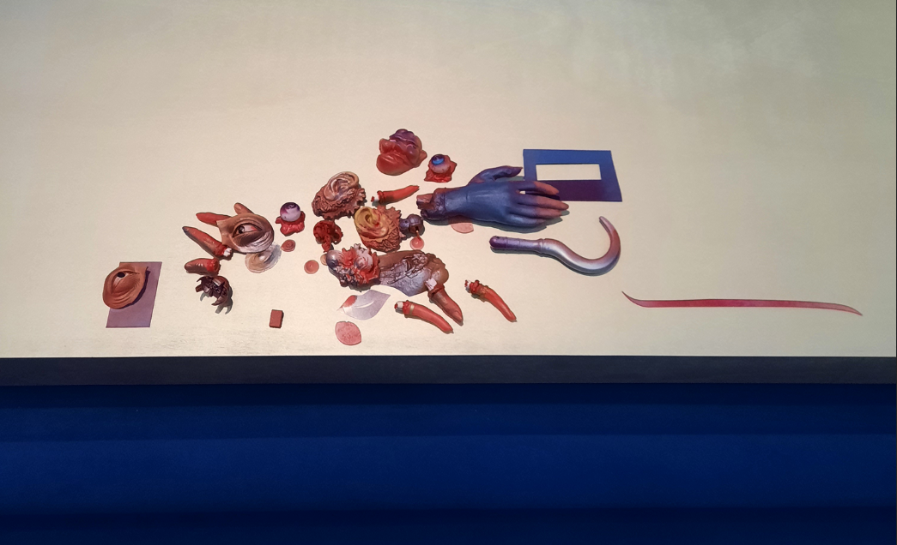
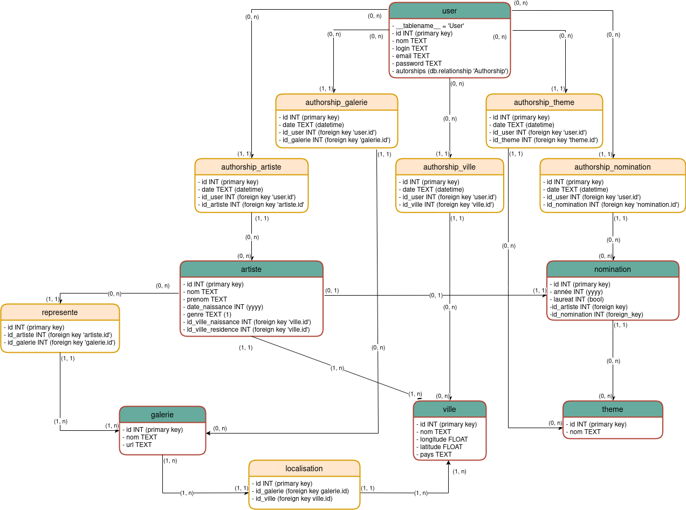

# duchamp_reader : une application pour explorer le prix Marcel Duchamp



Image: Isabelle Cornaro, *Installation pour le prix Marcel Duchamp*, 2021 (détail)

Le `duchamp_reader` est une application qui permet d'explorer les dernières éditions
du [prix Marcel Duchamp](https://fr.wikipedia.org/wiki/Prix_Marcel-Duchamp#) 
(2017-2020), où sont chaque année nominé.e.s 4 artistes (ou duo d'artiste.s)
contemporains français. Les artistes, les galeries qui les représentent, les
thèmes sur lesquels il.elle.s travaillent peuvent être explorés, ainsi que les
villes où sont né.e.s les artistes et où se trouvent les galeries qui les 
représentent.

Ce site a été développé dans le cadre du cours de python du master 2 TNAH de 
l'école des Chartes (2021-2022) en utilisant notamment les frameworks
 `flask` et `sqlalchemy`. Le code est disponible sous licence libre GNU GPL 3.

---

## Structure du dépôt

- [`duchamp_reader`](./duchamp_reader) : le dossier contenant l'application
	- `modeles` : les classes SQLAlchemy permettant de connecter la base de 
données à l'application
	- `static` : les données statiques: CSS, polices, javascript et images
	- `templates` : les fichiers HTML et JSON utilisés et générés pendant
l'utilisation de l'application
	- `utils` : des fonctions diverses utilisées pour le fonctionnement de 
l'application

---

## Installation (MAC-OS ou GNU Linux)

Pour lancer l'application, il est nécessaire d'avoir Python 3 installé sur son
ordinateur. Pour commencer, **ouvrir un terminal** et entrer les commandes : 

```shell
git clone https://github.com/paulhectork/tnah2021_python_duchamp_reader.git
# cloner le dépôt

cd tnah2021_python_duchamp_reader  # se déplacer dans le bon dossier

python -m venv env  # créer un environnement virutel

source env/bin/activate  # sélectionner l'intepréteur python

pip install -r requirements.txt  # installer les dépendances

python run.py #(ou 'python3 run.py' : lancer l'application)
```

Le présent dépôt ne contient pas de base de donnée: celle-ci est créée au premier 
lancement de l'application. Si par hasard il y a un problème au lancement de
l'application, modifier la ligne 17 du fichier `app.py`: à la place de
```python
app.config['SQLALCHEMY_DATABASE_URI'] = 'sqlite:///db.sqlite'
```

indiquer le chemin de la base de données "de secours":
```python
app.config['SQLALCHEMY_DATABASE_URI'] = 'sqlite:///db_backup.sqlite'
```

Pensez à vider le cache de votre navigateur avant de lancer le site ! Sinon, le 
CSS du site peut ne pas s'afficher correctement.

---

## Fonctionnalités

- navigation sur toutes les tables de la base de données avec renvois vers des pages
liées
- création, modification et suppresion de données dans la base de données à partir
de formulaires
- création et gestion de comptes d'utilisateur.ice.s
- création de cartes affichant des données géolocalisées dans les pages des 
artistes, des galeries et des villes
- construction de requêtes SPARQL lancées sur Wikidata pour les artistes de 
la base de données; les résultats sont téléchargeables en `rdf-xml`, `xml` et 
`json`.
- création de visualisations en fonction de données fournies par l'utilisateur.ice
via la librairie matplotlib

---

## Modèle de données

Ci-dessous, le modèle de données (qui a très légèrement évolué depuis ce schéma,
surtout au niveau des types de données):


